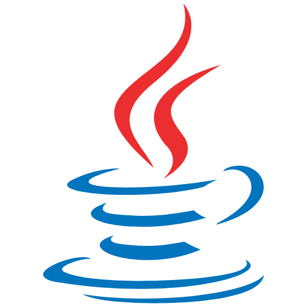
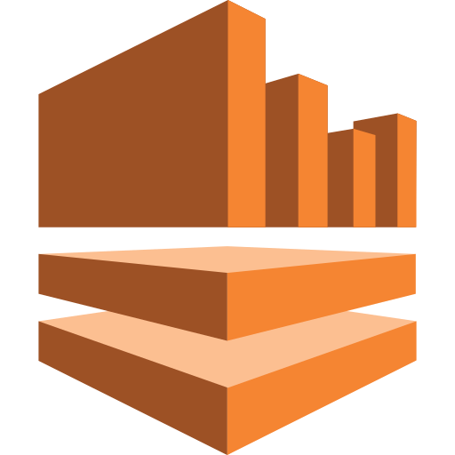
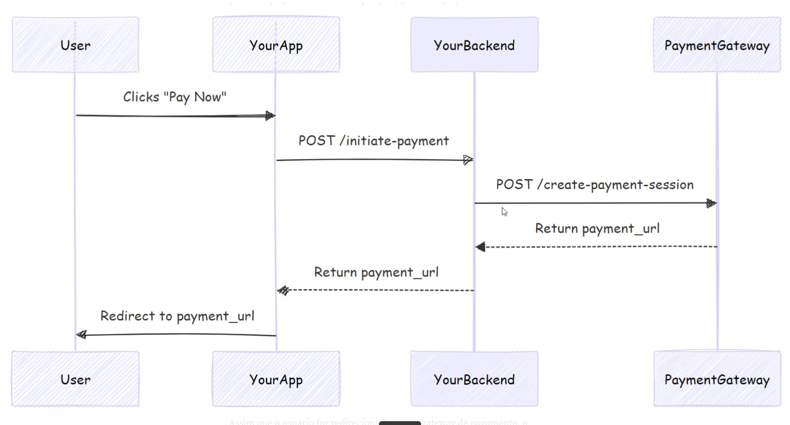
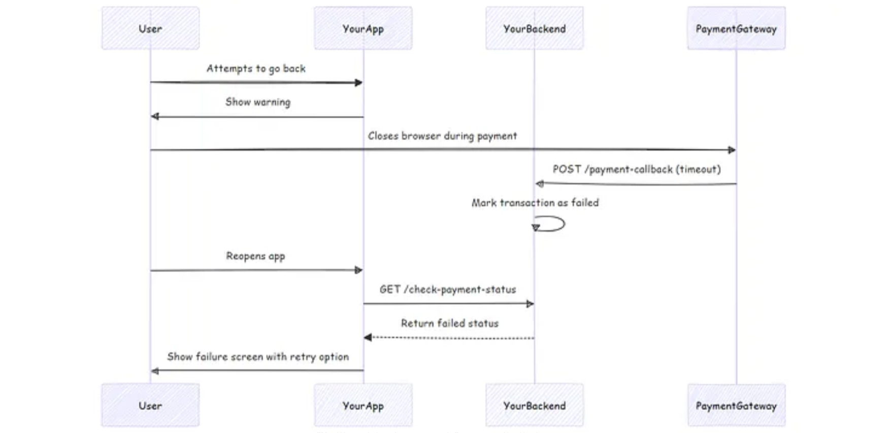

<p align="center">
  <strong>Gateway para Pagamentos Assíncrono</strong>
</p>

<p align="center">
  Sistema de pagamentos instantâneos, cloud-native e orientado a eventos,
  projetado com foco em baixa latência, alta performance, resiliência,
  consistência eventual e processamento financeiro assíncrono.
</p><br>

<p align="center">
  <!-- Linguagens -->
  
  
  
  
  
  
  
  

  <!-- Cloud -->
  
  
  

  <!-- DevOps / Infraestrutura -->
  
  
  
  
  

  <!-- Mensageria / Streaming -->
  
  
  

  <!-- Observabilidade -->
  
  
  

  <!-- Frontend -->
  

  <!-- Bancos de Dados -->
  
  
  
  
  
</p><br>

<p align="center">
  
  
  
  
  
  
  
</p>

---

# 📖 Visão Geral
Este projeto se destaca por sua forma de pagamentos instantâneos, com foco em **alta performance**, **resiliência** e **consistência eventual**. A solução foi construída com **arquitetura orientada a eventos (EDA)** e separada em microserviços principais.

Este gateway de pagamento online funciona basicamente como uma ponte entre o aplicativo que hospeda a etapa de finalização da compra e os sistemas responsáveis pelo processamento dos pagamentos, permitindo a transferência rápida e segura das informações pessoais e financeiras do cliente. Ele recebe os dados da transação, realiza as validações necessárias, criptografa as informações sensíveis e as encaminha para os processadores de pagamento de forma segura e em conformidade com os requisitos aplicáveis.

Após a autorização e o processamento da transação, o gateway comunica automaticamente o resultado do pagamento, informando se a operação foi aprovada ou recusada. Essa arquitetura permite que diferentes meios e provedores de pagamento sejam integrados de forma desacoplada, mantendo o fluxo de pagamento seguro, confiável e eficiente.

Além do processamento das transações, o gateway pode integrar-se a sistemas de contabilidade e plataformas de análise de dados, permitindo a sincronização de informações sobre pagamentos, cobranças recorrentes, fluxo de caixa e comportamento dos clientes. Dessa forma, a solução atua como um componente central da infraestrutura financeira da aplicação.

> **Documentação viva:** esta documentação encontra-se em evolução contínua e pode sofrer alterações conforme novos serviços, componentes, arquiteturas e capacidades são implementados.

---

## 🏗️ Princípios Arquiteturais

| Princípio | Descrição                                                                                                   |
|-----------|-------------------------------------------------------------------------------------------------------------|
| **Domain-Driven Design** | Decomposição de serviços orientada a domínios de negócio.                                                   |
| **Independent Deployment** | Cada serviço pode ser implantado independentemente.                                                         |
| **Event-Driven Communication** | Comunicação assíncrona baseada em eventos.                                                                  |
| **Distributed Transaction Coordination** | Coordenação de transações distribuídas com padrões como Saga Coreografada e Orquestrada com Outbox.         |
| **Resilience & Fault Isolation** | Isolamento de falhas e padrões de resiliência (Circuit Breaker, Retry, Bulkhead).                           |
| **Secure Service-to-Service** | Comunicação segura entre serviços com mTLS e autenticação mútua.                                            |
| **Centralized Observability** | Observabilidade centralizada com logs, métricas e traces distribuídos.                                      |
| **Infrastructure as Code** | Infraestrutura versionada e automatizada com Terraform.                                                     |
| **Automated CI/CD** | Pipelines de integração e entrega contínua automatizadas com verificação de imagens dos containers.         |
| **Cloud-Native Deployment** | Implantação em Kubernetes com escalabilidade automática juntamente com terraform em ambientes AWS e Google. |
| **Continuous Evolution** | Evolução contínua de capacidades de negócio.                                                                |

---

<h2>💳 Integrações de Pagamento e seus Setores</h2>

<p>
  O SpeedPag esta sendo projetado para oferecer uma camada bastante ampla de integração com soluções de pagamento, permitindo que aplicações utilizem varias formas para trabalhar com múltiplos parceiros nacionais e internacionais.
</p>

<h3 style="text-align: center;">🇧🇷 Instituições Nacionais</h3>

<p>
  Integrações voltadas para o ecossistema brasileiro, incluindo Pix,
  cartões e demais meios de pagamento que estao sendo trabalhadas nestas instituiçoes:
</p>

<p align="left">
  
  
  
  
  
  
  
  
  
  
</p>

---

<h3 style="text-align: center;">🌎 Instituições Internacionais</h3>

<p>
  Integrações para o ecossistema internacional, incluindo transaçoes,
  cartões e demais tipos de pagamento que esta sendo trabalhado nestas instituiçoes:
</p>

<p align="center">
  
  
  
  
  
</p>

---

# 🧭 Arquitetura, Fluxos e Diagramas da Plataforma

Esta seção apresenta os principais fluxos, componentes e decisões arquiteturais implementados na plataforma até o momento.
As imagens abaixo representam diferentes estágios de desenvolvimento e teste e destinam-se a fornecer evidência visual da plataforma operando com sucesso.

Os diagramas têm como objetivo facilitar a compreensão das interações entre serviços, infraestrutura e componentes da plataforma, servindo também como referência durante o desenvolvimento e evolução da arquitetura.

> A documentação é viva e pode ser atualizada continuamente a qualquer momento conforme novos serviços, integrações e componentes são implementados.

> Os screenshots são intencionalmente apresentados como evidência de implementação em vez de estarem atrelados a uma categoria específica de documentação. No entanto,
cada serviço tem suas imagens e explicaçao em suas devidas configurações.

> Nota: Os padrões apresentados nesta seção representam apenas os principais conceitos arquiteturais utilizados na plataforma. A documentação completa de cada domínio pode conter outros padrões e estratégias específicas. Para conhecer as demais implementações, consulte os links disponíveis nas respectivas seções e documentações dos serviços.

## Backend e Desenvolvimento das Configurações

A arquitetura segue o estilo de **microserviços desacoplados por eventos**, no qual cada serviço pode evoluir e ser implantado de forma independente. Em vez de uma chamada síncrona encadeando todas as etapas do pagamento, o sistema publica eventos e permite que os consumidores reajam de forma assíncrona, reduzindo acoplamento e melhorando escalabilidade.

O fluxo distribuído de pagamento utiliza o padrão **SAGA com coreografia**, no qual cada etapa do processamento reage ao evento anterior e emite um novo evento ao concluir sua responsabilidade. Esse modelo é adequado para cenários em que múltiplos serviços precisam manter consistência eventual sem depender de uma transação distribuída tradicional.

---

## Objetivos

- Receber requisições de pagamento com baixa latência.
- Processar débito e crédito de forma assíncrona.
- Garantir integridade transacional e consistência eventual.
- Permitir recuperação de falhas com SAGA baseada em coreografia.
- Escalar horizontalmente com Kubernetes.
- Monitorar saúde, throughput, lag e latência operacional.

---

## Integração do gateway de pagamento para design de sistemas

### 1. Iniciação de Pagamento
O processo de pagamento começa quando um usuário decide fazer uma compra. Veja como ele geralmente se desenrola:



---

### 2. Processamento de Pagamento
Assim que o usuário for redirecionado para o gateway de pagamento, o processamento propriamente dito terá início:


---

### 3. Conclusão do pagamento
Após o processamento, o gateway de pagamento informa seu aplicativo sobre o status da transação:


---

### 4. Tratamento de erros e casos extremos



## Módulos principais

| Módulo | Responsabilidade |
|---|---|
| `payment-handler` | Recebe a requisição HTTP, valida os dados, registra o pagamento e publica o evento inicial.
| `payment-processor` | Consome eventos do Kafka, executa débito/crédito, emite eventos de sucesso/falha e trata compensações. 
| `shared` | Centraliza contratos de eventos, bibliotecas internas e artefatos compartilhados entre os serviços. 
| `infra` | Reúne Docker, Kubernetes e Terraform para empacotamento e provisionamento da plataforma.
| `observability` | Contém dashboards, regras de alerta e artefatos para análise operacional.


## Fluxo de pagamento

1. O cliente envia uma requisição de pagamento para o `payment-handler`.
2. O `payment-handler` valida os dados, persiste o estado inicial da transação e publica um `PaymentRequestedEvent` no Kafka.
3. O `payment-processor` consome esse evento e inicia o fluxo de processamento financeiro. 
4. O débito é executado na conta de origem; se bem-sucedido, o serviço segue para o crédito da conta de destino.
5. Se todas as etapas forem concluídas, um evento final de sucesso é publicado.
6. Se alguma etapa falhar após uma operação parcial, eventos de compensação são disparados para restaurar consistência.
7. As métricas operacionais e de latência são expostas para observabilidade e acompanhamento contínuo.

## Estrutura Central

```text
speedpag/
├── README.md                         # Visão geral do projeto, arquitetura e instruções de uso
├── docs/                            # Documentação técnica e arquitetural
│   ├── architecture/                # Diagramas e descrições da arquitetura
│   │   ├── system-design.md         # Visão macro da solução
│   │   ├── event-flow.md            # Fluxo de eventos entre os serviços
│   │   ├── saga-choreography.md     # Estratégia de consistência com SAGA
│   │   └── sequence-diagrams/       # Diagramas de sequência
│   ├── api/                         # Contratos e documentação de API
│   │   ├── payment-handler-openapi.yaml # Especificação OpenAPI do handler
│   │   └── payment-contracts.md     # Contratos síncronos e assíncronos
│   ├── adr/                         # Architecture Decision Records
│   │   ├── 001-use-kafka.md
│   │   ├── 002-use-saga-choreography.md
│   │   └── 003-use-quarkus-reactive.md
│   └── runbooks/                    # Procedimentos operacionais e resposta a incidentes
│       ├── incident-kafka-lag.md
│       ├── incident-payment-stuck.md
│       └── rollback.md
│
├── services/                        # Microserviços da aplicação
│   ├── payment-handler/             # Serviço de entrada dos pagamentos
│   │   ├── pom.xml                  # Dependências e build do módulo
│   │   └── src/
│   │       ├── main/
│   │       │   ├── java/com/speedpag/pix/handler/
│   │       │   │   ├── api/         # Endpoints REST, DTOs e mapeadores
│   │       │   │   ├── application/ # Casos de uso e serviços de aplicação
│   │       │   │   ├── domain/      # Entidades, eventos e regras de negócio
│   │       │   │   ├── infrastructure/ # Kafka, persistência, configs, métricas
│   │       │   │   └── shared/      # Utilitários internos do serviço
│   │       │   └── resources/
│   │       │       ├── application.properties # Configuração do Quarkus
│   │       │       └── db/migration/ # Migrações SQL
│   │       └── test/
│   │           ├── java/com/speedpag/pix/handler/
│   │           │   ├── unit/        # Testes unitários
│   │           │   ├── integration/ # Testes de integração
│   │           │   └── contract/    # Testes de contrato
│   │           └── resources/
│   │
│   └── payment-processor/           # Serviço de processamento assíncrono
│       ├── pom.xml                  # Dependências e build do módulo
│       └── src/
│           ├── main/
│           │   ├── java/com/speedpag/pix/processor/
│           │   │   ├── consumer/    # Consumidores Kafka
│           │   │   ├── application/ # Casos de uso e orquestração do fluxo
│           │   │   ├── domain/      # Entidades, eventos e regras de negócio
│           │   │   ├── infrastructure/ # Persistência, locks, mensageria, métricas
│           │   │   └── shared/      # Utilitários internos
│           │   └── resources/
│           │       ├── application.properties
│           │       └── db/migration/
│           └── test/
│               ├── java/com/speedpag/pix/processor/
│               │   ├── unit/
│               │   ├── integration/
│               │   └── e2e/
│               └── resources/
│
├── shared/                          # Artefatos compartilhados entre os módulos
│   ├── contracts/                   # Contratos e schemas de eventos
│   │   ├── events/                  # Avro/JSON Schemas dos eventos Kafka
│   │   ├── dto/                     # DTOs compartilháveis
│   │   └── headers/                 # Cabeçalhos padronizados para mensageria
│   ├── libs/                        # Bibliotecas internas reutilizáveis
│   │   ├── idempotency-lib/
│   │   ├── tracing-lib/
│   │   └── exception-lib/
│   └── test-fixtures/               # Massa de testes e utilitários
│
├── infra/                           # Infraestrutura do projeto
│   ├── docker/                      # Dockerfiles dos microserviços
│   ├── kubernetes/                  # Manifests K8s e overlays por ambiente
│   │   ├── base/
│   │   └── overlays/
│   └── terraform/                   # Provisionamento da infraestrutura
│       ├── modules/
│       ├── envs/
│       └── versions.tf
│
├── deploy/                          # Scripts de build, deploy e rollback
│   ├── scripts/
│   └── helm/
│
├── observability/                   # Observabilidade e testes de carga
│   ├── dashboards/                  # Dashboards operacionais
│   ├── alerts/                      # Alertas e regras Prometheus
│   └── load-test/                   # Cenários de performance (k6/Gatling)
│
├── .github/
│   └── workflows/                   # Pipelines CI/CD
│
├── pom.xml                          # POM agregador do monorepo
└── .gitignore
```

## Organização interna dos serviços

Cada microserviço segue uma separação por camadas para manter o código mais claro e mais fácil de evoluir. Essa organização ajuda a isolar a lógica do domínio da tecnologia usada para expor APIs, persistir dados e publicar eventos. 

- `api/`: endpoints, requests, responses e mapeadores.
- `application/`: casos de uso e serviços que coordenam o fluxo.
- `domain/`: entidades, eventos e regras de negócio.
- `infrastructure/`: integração com Kafka, banco, métricas e configurações.
- `test/`: testes unitários, integração, contrato e ponta a ponta.

## Como executar localmente

### Pré-requisitos

- Java 17+
- Maven 3.9+
- Docker e Docker Compose
- Kubernetes local opcional, como Kind ou Minikube
- PostgreSQL
- Apache Kafka

### Passos

1. Suba os serviços de infraestrutura, como PostgreSQL e Kafka, com Docker Compose.
2. Compile o projeto raiz ou os módulos individualmente com Maven.
3. Execute o `payment-handler` e o `payment-processor` em modo de desenvolvimento do Quarkus. 
4. Envie uma requisição HTTP para o endpoint de pagamentos.
5. Acompanhe o fluxo pelos logs, tópicos Kafka e métricas exportadas.

## Observabilidade

O projeto foi pensado para permitir análise operacional ponta a ponta. As métricas expostas pelos serviços podem ser coletadas pelo Prometheus, enquanto dashboards podem consolidar indicadores como taxa de sucesso, tempo de processamento, throughput, lag dos consumidores e latência P99.

Indicadores de:

- Tempo total de processamento por pagamento.
- Latência P50, P95 e P99.
- Taxa de sucesso e taxa de falha.
- Tamanho de filas e lag dos consumidores Kafka.
- Quantidade de compensações executadas.
- Volume de pagamentos por segundo.

