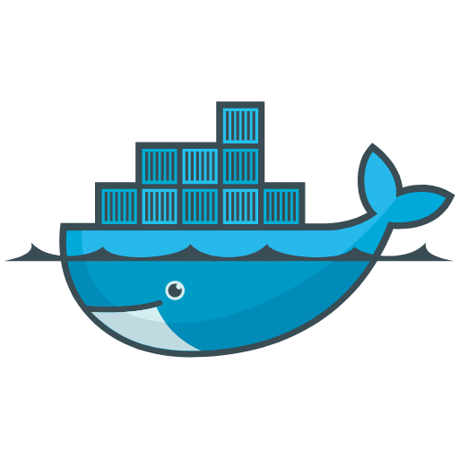
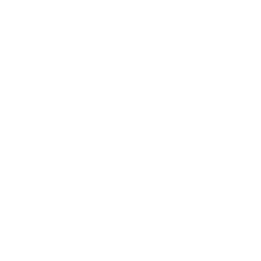
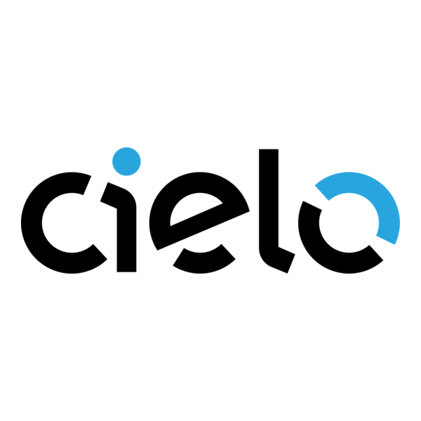
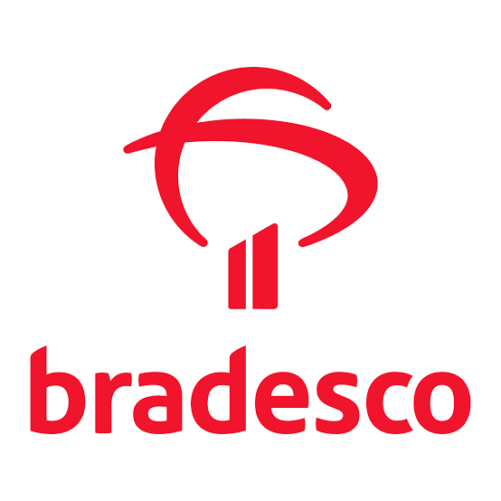
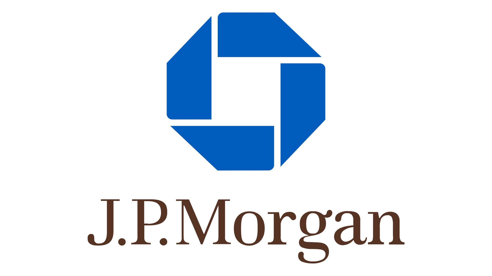
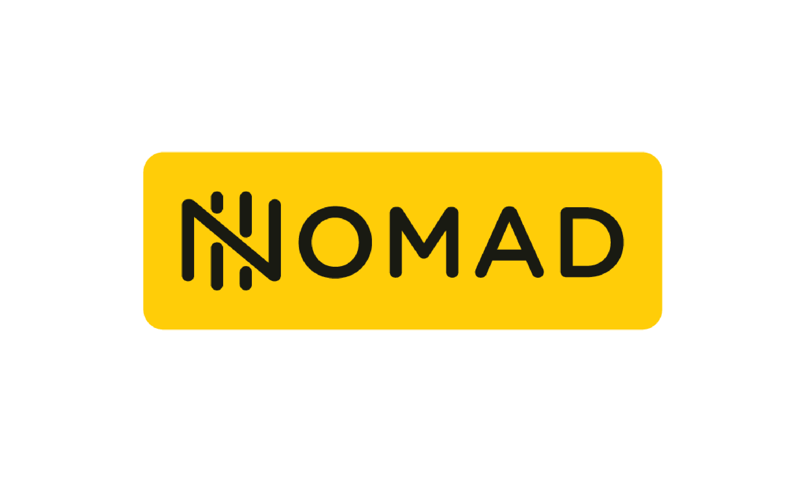
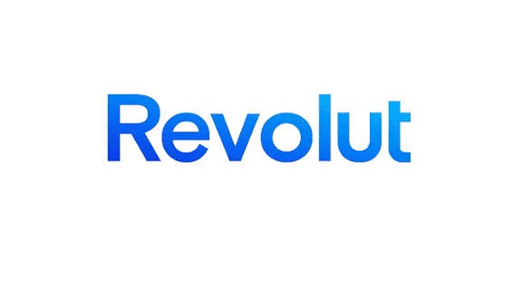
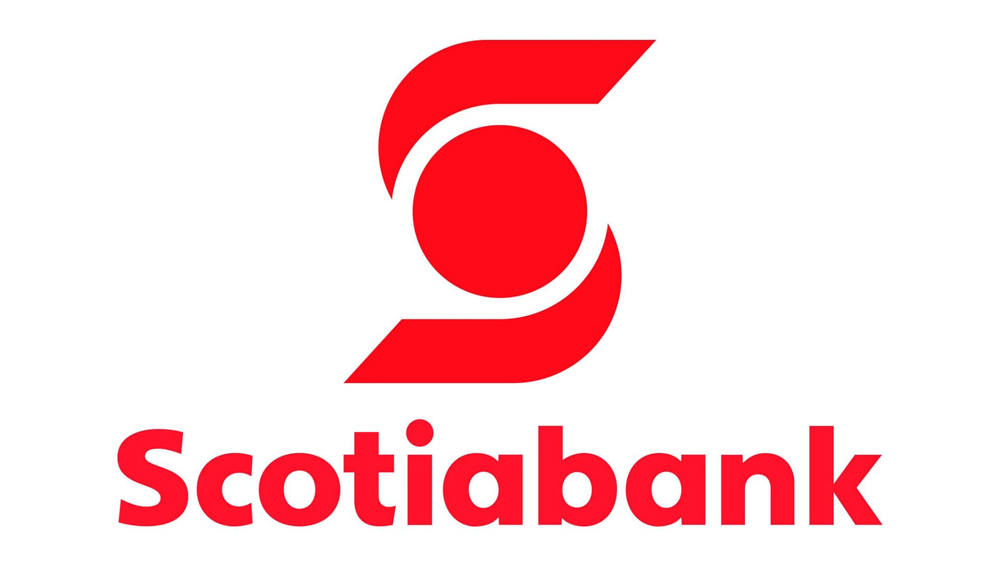

  <strong>Gateway para Pagamentos Assíncrono</strong>

  Sistema de pagamentos instantâneos, cloud-native,
  projetado com foco em baixa latência, alta performance, resiliência,
  consistência eventual e processamento financeiro assíncrono.

 

  <!-- Linguagens -->
  
  
  
  
  
  
  
  

  <!-- Cloud -->
  
  
  

  <!-- DevOps / Infraestrutura -->
  
  
  
  
  

  <!-- Mensageria / Streaming -->
  
  
  

  <!-- Observabilidade -->
  
  
  

  <!-- Frontend -->
  

  <!-- Bancos de Dados -->
  
  
  
  
  

 

  
  
  
  
  
  
  

---

# 📖 Visão Geral
Este projeto se destaca por sua forma de pagamentos instantâneos, com foco em **alta performance**, **resiliência** e **consistência eventual**.

Este gateway de pagamento online funciona basicamente como uma ponte entre o aplicativo que hospeda a etapa de finalização da compra e os sistemas responsáveis pelo processamento dos pagamentos, permitindo a transferência rápida e segura das informações pessoais e financeiras do cliente. Ele recebe os dados da transação, realiza as validações necessárias, criptografa as informações sensíveis e as encaminha para os processadores de pagamento de forma segura e em conformidade com os requisitos aplicáveis.

Após a autorização e o processamento da transação, o gateway comunica automaticamente o resultado do pagamento, informando se a operação foi aprovada ou recusada. Essa arquitetura permite que diferentes meios e provedores de pagamento sejam integrados de forma desacoplada, mantendo o fluxo de pagamento seguro, confiável e eficiente.

Além do processamento das transações, o gateway pode integrar-se a sistemas de contabilidade e plataformas de análise de dados, permitindo a sincronização de informações sobre pagamentos, cobranças recorrentes, fluxo de caixa e comportamento dos clientes. Dessa forma, a solução atua como um componente central da infraestrutura financeira da aplicação.

> **Documentação viva:** esta documentação encontra-se em evolução contínua e pode sofrer alterações conforme novos serviços, componentes, arquiteturas e capacidades são implementados.

---

## 🏗️ Princípios Arquiteturais

| Princípio | Descrição                                                                                                   |
|-----------|-------------------------------------------------------------------------------------------------------------|
| **Domain-Driven Design** | Decomposição de serviços orientada a domínios de negócio.                                                   |
| **Independent Deployment** | Cada serviço pode ser implantado independentemente.                                                         |
| **Event-Driven Communication** | Comunicação assíncrona baseada em eventos.                                                                  |
| **Distributed Transaction Coordination** | Coordenação de transações distribuídas com padrões como Saga Coreografada e Orquestrada com Outbox.         |
| **Resilience & Fault Isolation** | Isolamento de falhas e padrões de resiliência (Circuit Breaker, Retry, Bulkhead).                           |
| **Secure Service-to-Service** | Comunicação segura entre serviços com mTLS e autenticação mútua.                                            |
| **Centralized Observability** | Observabilidade centralizada com logs, métricas e traces distribuídos.                                      |
| **Infrastructure as Code** | Infraestrutura versionada e automatizada com Terraform.                                                     |
| **Automated CI/CD** | Pipelines de integração e entrega contínua automatizadas com verificação de imagens dos containers.         |
| **Cloud-Native Deployment** | Implantação em Kubernetes com escalabilidade automática juntamente com terraform em ambientes AWS e Google. |
| **Continuous Evolution** | Evolução contínua de capacidades de negócio.                                                                |

---

<h2>💳 Integrações de Pagamento e seus Setores</h2>

  O SpeedPag esta sendo projetado para oferecer uma camada bastante ampla de integração com soluções de pagamento, permitindo que aplicações utilizem varias formas para trabalhar com múltiplos parceiros nacionais e internacionais.

<h3 style="text-align: center;">🇧🇷 Instituições Nacionais</h3>

  Integrações voltadas para o ecossistema brasileiro, incluindo Pix,
  cartões e demais meios de pagamento que estao sendo trabalhadas nestas instituiçoes:

  
  
  
  
  
  
  
  
  
  

---

<h3 style="text-align: center;">🌎 Instituições Internacionais</h3>

  Integrações para o ecossistema internacional, incluindo transaçoes,
  cartões e demais tipos de pagamento que esta sendo trabalhado nestas instituiçoes:

  
  
  
  
  

---

# 🧭 Arquitetura, Fluxos e Diagramas da Plataforma

Esta seção apresenta os principais fluxos, componentes e decisões arquiteturais implementados na plataforma até o momento.
As imagens abaixo representam diferentes estágios de desenvolvimento e teste e destinam-se a fornecer evidência visual da plataforma operando com sucesso.

Os diagramas têm como objetivo facilitar a compreensão das interações entre serviços, infraestrutura e componentes da plataforma, servindo também como referência durante o desenvolvimento e evolução da arquitetura.

> A documentação é viva e pode ser atualizada continuamente a qualquer momento conforme novos serviços, integrações e componentes são implementados.

> Os screenshots são intencionalmente apresentados como evidência de implementação em vez de estarem atrelados a uma categoria específica de documentação. No entanto,
cada serviço tem suas imagens e explicaçao em suas devidas configurações.

> Nota: Os padrões apresentados nesta seção representam apenas os principais conceitos arquiteturais utilizados na plataforma. A documentação completa de cada domínio pode conter outros padrões e estratégias específicas. Para conhecer as demais implementações, consulte os links disponíveis nas respectivas seções e documentações dos serviços.

em desenvolvimento.

